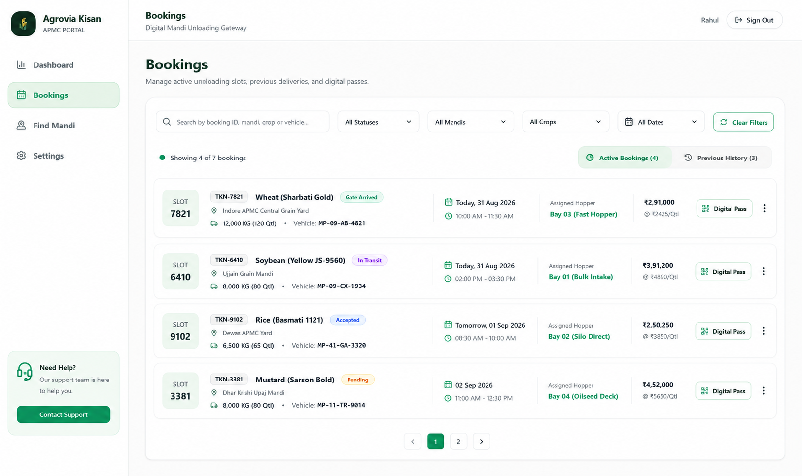

I have also attached a UI reference image for the desired Bookings page design.

IMPORTANT:
Use the attached reference image ONLY as a visual/design reference for the Bookings page.

Do NOT copy the exact data shown in the reference.
Use the application's existing booking data.

Match the reference in terms of:
- Layout
- Spacing
- Typography hierarchy
- Filter toolbar
- Search field
- Status badges
- Booking card/row structure
- Tabs
- Button styling
- Colors
- Borders
- Shadows
- Overall visual hierarchy

Preserve the existing Agrovia Kisan branding and application structure.

Do NOT change any other page or component outside the Bookings feature.